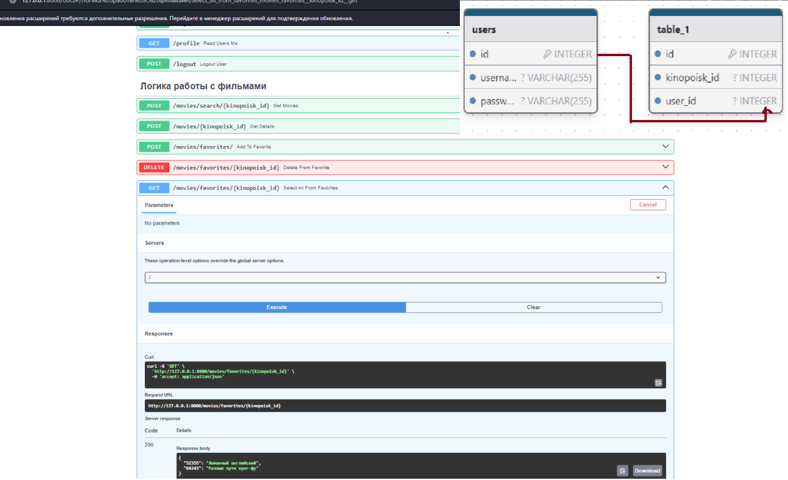

### Как запустить 
```
cоздать .env и ввести данные для полей как в .env-example
docker compose up -- build
poetry install
alembic upgrade head
uvicorn src.main:app --reload
http://127.0.0.1:8000/docs/
```
### Что сделал 
```
Класс для работы с внешним API(тоже работает асинхронно)
Эндпоинты с базовой валидацией ( Как и питоновская , так и pydantic)
JWT , защита от неавторизованного доступа.
Пароли захешированы , База данных через Докер 
```


Днем добавлю проверку редких тест кейсов и полноценный докер компос .

На текущий момент момент потрачено 3ч